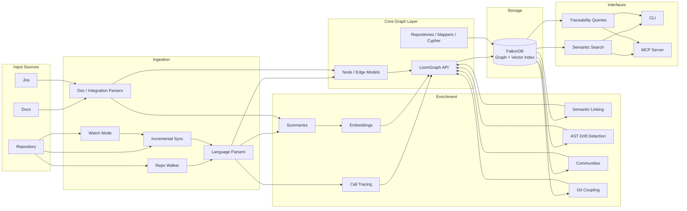

# Loom: Architecture & Codebase Guide

This document explains what the Loom project is trying to achieve, and how the main packages/modules fit together.

It is intentionally **high-level** (module and subsystem oriented) rather than a complete function-by-function reference.

---

## System overview

Loom is a graph-backed code intelligence system.

It ingests:

- source repositories
- technical documentation
- external knowledge sources such as Jira

It then turns those inputs into a shared graph that can be:

- queried semantically
- traversed structurally
- enriched incrementally
- exposed to editors and agents through MCP

### High-level architecture flow

---

## Project goal (what we’re trying to achieve)

Loom is a code, document, and traceability intelligence system.

At a high level, Loom:

- Walks a repository (gitignore-aware, safe directory traversal)
- Parses supported files into a uniform internal representation (`Node` objects)
- Extracts relationships between nodes (`Edge` objects), e.g. call graphs
- Ingests documents and external systems into the same graph model
- Stores and queries these nodes/edges in a graph database (FalkorDB)
- Enables downstream analysis (communities, coupling, traversal, search, drift, traceability)

The design aim is to:

- Support **multi-language parsing** (tree-sitter based for code languages)
- Treat non-code “markup/config” files as **first-class FILE nodes**
- Keep IDs stable and deterministic so graphs are reproducible
- Be resilient (skip unsupported files, tolerate parse errors)
- Support both **full indexing** and **incremental updates**
- Make the graph usable both for humans and for agent tooling

---

## Main subsystems

At a system level, Loom is organized into a few major subsystems:

- **Core graph model**
  - `Node`, `Edge`, enums, ID conventions, and graph-facing APIs

- **Persistence layer**
  - FalkorDB gateway, repositories, Cypher helpers, schema initialization, vector index setup

- **Ingestion layer**
  - repository walking, code parsing, document ingestion, Jira ingestion, incremental sync, watch mode

- **Analysis and enrichment**
  - call tracing, static summaries, embeddings, semantic linking, community detection, coupling, AST drift detection

- **Interfaces**
  - CLI commands and FastMCP tools

These are intentionally separated so parsing, persistence, enrichment, and querying can evolve independently while still sharing one graph model.

---

## Key concepts / data model

### `Node` (`loom.core.node`)
A `Node` is the canonical unit of information for both:

- Code symbols (functions/classes/methods/etc.)
- File-level “document” objects (FILE nodes)
- Document structure (doc/section/chapter/etc.)

Important fields:

- `id`: globally unique identifier
- `kind`: enum (`NodeKind`) such as `FUNCTION`, `CLASS`, `FILE`, etc.
- `source`: `CODE` vs `DOC`
- `name`, `path`: human-friendly identifiers
- `start_line`, `end_line`, `language`: code-only metadata
- `metadata`: extensible dictionary for extracted facts (framework hints, Rails DSL, etc.)

ID conventions:

- Code nodes: `<kind.value>:<path>:<symbol>`
  - Produced by `Node.make_code_id(kind, path, symbol)`
- Doc nodes: `doc:<doc_path>:<section_ref>`
  - Produced by `Node.make_doc_id(doc_path, section_ref)`

### `Edge` + `EdgeType` (`loom.core.edge`)
An `Edge` links two nodes.

Typical examples:

- `CALLS`: function A calls function B
- additional edge types exist for structural, traceability, and enrichment relationships

Edges can carry:

- `confidence`: float that can encode heuristic strength
- `metadata`: e.g. `{unresolved: true, ambiguous: true}`

### Graph storage (`loom.core.graph` + `loom.core.falkor.*`)
Graph persistence is via FalkorDB.

- Nodes are stored as `(:Node { ...props... })` plus an additional per-kind label, e.g. `(:Function)`
- Edges are stored as relationships between nodes
- Schema initialization creates property indexes and a vector index on `Node.embedding` for similarity search

The graph acts as the system of record for:

- structural relationships
- semantic links
- traceability edges
- embeddings
- graph analysis outputs such as communities and coupling

---

## Parsing pipeline (end-to-end)

The core “ingest code” pipeline is in `loom.analysis.code.parser`:

1. **`parse_repo(root)`**
   - If `root` is a file → delegates to `parse_code(root)`
   - If `root` is a directory:
     - Calls `walk_repo(root)` to discover files (gitignore-aware)
     - For each discovered file, calls `parse_code(file)`
     - Aggregates and returns a single flat list of `Node`s

2. **`walk_repo(root)`** (`loom.ingest.code.walker`)
   - Uses root-level `.gitignore` via `pathspec`
   - Skips default directories (`DEFAULT_SKIP_DIRS`), hidden directories, and symlinked directories
   - Groups results by language
   - Special-cases `.env*` files by **filename prefix** because suffix-based extension logic can be misleading

3. **`parse_code(path)`** (`loom.analysis.code.parser`)
   - Converts `path` to a `Path` and determines the extension
   - Special-cases `.env*` by forcing the logical extension to `.env`
   - Uses `LanguageRegistry` to decide whether to skip and which parser to call

4. **Language parsers** (`loom.ingest.code.languages.*`)
   - Code languages typically use tree-sitter to extract functions/classes/etc.
   - Markup/config parsers create a `FILE` node with metadata rather than symbol extraction

This parsing pipeline is only one part of ingestion. Full indexing also includes summarization, embedding, semantic linking, graph enrichment, and persistence.

---

## Full indexing lifecycle

The main full-index workflow lives in `loom.ingest.pipeline.index_repo()`.

At a high level it:

1. discovers repository files
2. parses changed or new files
3. creates file and symbol nodes
4. extracts call relationships where supported
5. summarizes nodes
6. generates embeddings
7. persists graph state
8. ingests docs and optional Jira nodes
9. performs semantic linking between code and docs

Expensive graph enrichment is intentionally split out of `analyze`:

- `loom enrich` runs community detection
- `loom enrich` runs git coupling analysis

This means Loom is not just a parser. It is an ingest-and-enrich pipeline that builds a usable graph for search, traceability, and agents.

---

## Incremental update lifecycle

Incremental updates are handled primarily by `loom.ingest.incremental.sync_commits()` and `loom.watch.watcher.watch_repo()`.

Key behaviors:

- git-diff-based changed file detection
- node-level diffing based on content hashes
- invalidation of stale computed edges on file change or delete
- preservation and stale marking of human-linked relationships
- rename-aware migration of human edges where possible
- AST drift detection for changed code nodes
- watch-mode reindexing on local filesystem change

The architecture intentionally supports both:

- **batch rebuilds** with `analyze`
- **incremental graph maintenance** with `sync` and `watch`

---

## `parse_repo()`

`parse_repo(root, exclude_tests=False)` lives in `loom.analysis.code.parser`.

### `parse_repo(root, exclude_tests=False)`
 This is the **authoritative** repo parser.

What it does:

- Uses `walk_repo()` for discovery (gitignore-aware, symlink-safe)
- Delegates each file to `parse_code()` which delegates to the language registry
- Returns a flat `list[Node]`
- Logs how many files were parsed and how many nodes were produced

When to use it:

- **Always use this** for repo-level parsing.

---

## LanguageRegistry (extension → parser mapping)

Module: `loom.ingest.code.registry`

Responsibilities:

- Maintain `extension -> parser` mapping
- Decide which files/dirs to skip

Key behaviors:

- `should_skip_dir(dirname)`:
  - skips hidden dirs and configured skip dirs
- `should_skip_file(extension)`:
  - skips known unparseable extensions
  - skips extensions not registered
- `_register_defaults(reg)`:
  - registers code languages (py/ts/js/go/java/rust/ruby)
  - registers markup/config languages (html/xml/json/css/yaml/properties/toml/ini/env)

---

## Call graph extraction (Python)

Module: `loom.analysis.code.calls`

Responsibilities:

- Parse a Python file with tree-sitter
- Extract call sites from function bodies
- Resolve call targets against known symbols
- Create `EdgeType.CALLS` edges

Important details:

- `_extract_call_name()` assigns a name + confidence based on how direct the call is:
  - `foo()` is high confidence
  - `obj.foo()` is slightly lower
  - computed calls (dynamic) become unresolved
- `trace_calls()` accepts `all_symbols: dict[str, list[Node]]` to avoid collisions when multiple methods share the same name
- Ambiguity resolution heuristics:
  - Prefer same-file candidates
  - Prefer `FUNCTION` over `METHOD` if it yields a single match
  - Otherwise mark unresolved/ambiguous

---

## Graph API and repositories

### `LoomGraph` (`loom.core.graph`)
High-level async API around FalkorDB:

- Initializes schema
- Provides node/edge CRUD + bulk insert
- Provides traversal (`neighbors`)
- Provides `delete()` to clear graph contents (used for test isolation)

### Falkor gateway + repositories (`loom.core.falkor.*`)

- `gateway.py`: low-level DB connection and query execution
- `schema.py`: index creation, vector index creation, and idempotency handling
- `repositories.py`:
  - `NodeRepository`: upsert/get/delete/bulk_upsert
  - `EdgeRepository`: upsert + **chunked** bulk_upsert to avoid OOM/timeouts
  - `TraversalRepository`: neighbor traversal in steps
- `queries.py`: centralized cypher templates

---

## Development utilities

Module: `loom.devtools`

- `check_deps()`: verify declared dependencies are installed
- `run_tests()`: runs tests via `unittest` discovery

Note: In this repo, tests are primarily run with `pytest` (via `uv run pytest ...`).

---

## Where to start (entrypoints)

- CLI entrypoint: `loom.cli:main`
- Primary parsing APIs:
  - `loom.analysis.code.parser.parse_repo()`
  - `loom.analysis.code.parser.parse_code()`
- Primary indexing APIs:
  - `loom.ingest.pipeline.index_repo()`
  - `loom.ingest.incremental.sync_commits()`
- Graph API:
  - `loom.core.graph.LoomGraph`
- MCP entrypoint:
  - `loom.mcp.server.build_server()`

---

## Glossary

- **Ingest**: discover + parse files into `Node`s
- **Analysis**: compute relationships/communities/embeddings over those nodes
- **FalkorDB**: graph database used for persistence and traversal
- **tree-sitter**: incremental parser used for multi-language AST extraction
